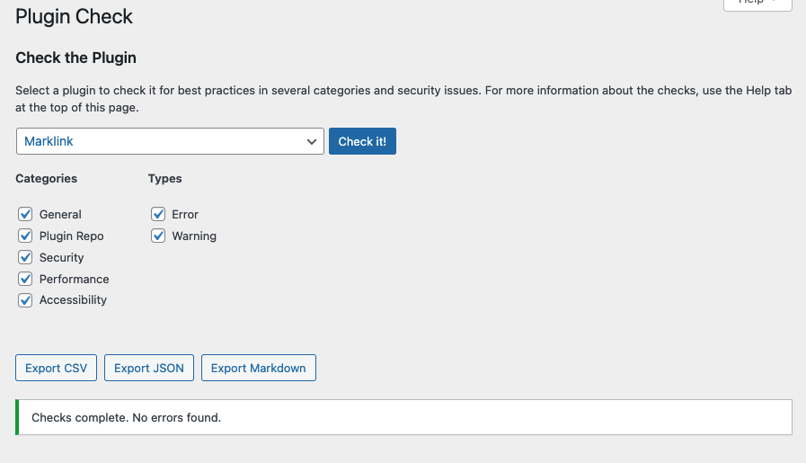

# Marklink

Auto-expose Markdown for WordPress websites and create `llms.txt`.

[](https://www.gnu.org/licenses/gpl-2.0.html)


## What It Does

Marklink is a zero-configuration WordPress plugin that makes your site's content available as Markdown. Install it, activate it, and every published post/page gets a `.md` endpoint plus auto-generated site indexes at `/llms.txt` and `/llms-full.txt`.

### Endpoints

| URL | Description |
|---|---|
| `yoursite.com/any-page.md` | That page as Markdown |
| `yoursite.com/index.md` | Homepage as Markdown |
| `yoursite.com/llms.txt` | Index of recent 20 posts |
| `yoursite.com/llms-full.txt` | Full content archive |

You can also request any page as Markdown via the `Accept: text/markdown` header.

### Features

- **Markdown endpoints** for every published post and page (`.md` suffix)
- **Header-based delivery** via `Accept: text/markdown`
- **Auto-generated indexes** at `/llms.txt` and `/llms-full.txt`
- **Smart filtering** — excludes posts with "copy" or "sample" in the title/slug
- **Custom post type support** — works with any public post type
- **Settings page** — configure excluded words, post limits, post types, and toggle endpoints
- **No external requests** — runs entirely on your server

## Installation

### From zip

1. Download or build `marklink.zip`
2. In WordPress admin, go to **Plugins → Add New → Upload Plugin**
3. Upload the zip and click **Install Now**
4. Click **Activate**
5. Go to **Settings → Marklink** to configure
6. Go to **Settings → Permalinks** and click **Save Changes** (flushes rewrite rules)

### Manual

1. Copy the `marklink/` folder to `wp-content/plugins/`
2. Activate through **Plugins** in WordPress
3. Configure at **Settings → Marklink**
4. Save permalinks (step 6 above)

## Usage

```bash
# Get a page as Markdown
curl https://yoursite.com/about.md

# Use the Accept header instead
curl -H "Accept: text/markdown" https://yoursite.com/about/

# Get the site index
curl https://yoursite.com/llms.txt
```

## FAQ

**The endpoints return 404.**
Go to **Settings → Permalinks** and click **Save Changes**. This registers the rewrite rules.

**Does this expose private content?**
No. Only published posts and pages are served. Drafts, private, and password-protected content are excluded.

**Does this contact any external services?**
No. Marklink runs entirely on your server. No data is sent anywhere.

**Does it work with caching plugins?**
Yes. You may want to exclude `.md` URLs and `/llms.txt` from your cache for real-time updates.

**Can I customize which posts are excluded?**
Go to **Settings → Marklink** and edit the "Excluded words" field.

## Plugin Check



## Changelog

### 0.0.1

- Initial release
- Markdown endpoint support (`.md` URLs)
- Accept header support (`text/markdown`)
- Site index generation (`/llms.txt`, `/llms-full.txt`)
- Settings page (excluded words, post limit, post types, endpoint toggles)
- Custom post type support

## License

GPLv2 or later. See [LICENSE](LICENSE) for the full text.
